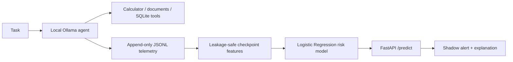

# Agent Failure Predictor

An end-to-end ML project that observes a local tool-using LLM agent, converts its runtime logs into leakage-safe features, and estimates whether the current run is likely to fail.

It is intentionally a research prototype—not a claim that one model can predict failure for every agent framework. The project demonstrates the full loop: agent telemetry, data generation, model training, live shadow-mode inference, explanations, and genuinely held-out evaluation.

## What it does



The agent logs each LLM call and tool call. At every checkpoint, the predictor uses only information already observed—latency, retries, tool errors, token counts, repeated calls, and related runtime features—to return a failure-risk probability. It never uses the final answer or final outcome as a feature.

## Results

The main real-world result comes from a final held-out evaluation: 300 local Ollama runs across 30 task templates that were not used for training or threshold selection.

| Metric | Held-out result |
| --- | ---: |
| Precision | 59.3% |
| Recall | 65.0% |
| Specificity | 76.6% |
| Accuracy | 72.7% |
| False-alert rate on successful runs | 23.4% |

That result is promising but intentionally reported with its limitations: the synthetic-trained baseline still misses 35% of failed runs and alerts on roughly one in four successful runs. See [the detailed results](project_documentation/EXPERIMENT_RESULTS.md).

## Quick start

### 1. Prerequisites

- Python 3.11+
- [Ollama](https://ollama.com/) running locally
- A pulled local model; the project was developed with `llama3.2:3b`.

```powershell
ollama pull llama3.2:3b
python -m venv .venv
.\.venv\Scripts\Activate.ps1
pip install -e ".[dev]"
```

### 2. Run the instrumented agent

```powershell
agent-run "What is 18 multiplied by 7?" --model llama3.2:3b
```

The local telemetry is written to `telemetry/steps.jsonl` and `telemetry/runs.jsonl`. Those files are generated locally and excluded from Git.

### 3. Start failure-risk inference

The small trained model bundle required by the API is included in the repository.

```powershell
uvicorn api.main:app --reload
```

Open `http://127.0.0.1:8000/docs`, or enable shadow-mode scoring during a run:

```powershell
agent-run "What is 18 multiplied by 7?" --model llama3.2:3b --prediction-endpoint http://127.0.0.1:8000
```

## Can I use another local model?

Yes, for the **agent**. Any model already available through Ollama can be passed with `--model`:

```powershell
ollama list
agent-run "List customers with a balance over 1000." --model <your-ollama-model>
```

The agent needs a model that can reliably follow the system prompt and call tools. Native Ollama tool calling is preferred; the runner also supports a narrow JSON-shaped fallback for smaller local models. Quality will vary: a weak model may answer without using a tool, produce malformed tool arguments, or struggle with the required schema-discovery step before SQL. Those behaviors are useful telemetry, but they can lower task success.

The **failure predictor** is a separate local scikit-learn model trained on this project's telemetry distribution. It will run for another Ollama model because the feature schema is the same, but its probabilities are not automatically calibrated for that new model. Collect and label that model's runs before treating its alert scores as reliable.

## Reproduce the project

Run tests:

```powershell
python -m pytest -q
```

Generate a synthetic dataset and its exploratory report:

```powershell
python -m agent_failure_predictor.generate_dataset --help
python -m analysis.explore_dataset --help
```

Train a baseline model:

```powershell
python -m models.train_logistic_regression --help
```

For real-agent evaluation, use the versioned task banks in `data/tasks/`. The V3 bank is held out and must not be used for fitting or threshold selection; see [its guide](docs/HELD_OUT_TASK_BANK_V3_README.md).

## Repository map

```text
agent_failure_predictor/  Local agent, telemetry, task evaluation, failure injection
features/                 Checkpoint feature engineering
models/                   Training, comparison, and explainability code
api/                      FastAPI prediction service
analysis/                 EDA and real-run reporting
data/tasks/               Versioned deterministic evaluation task banks
docs/                     Focused implementation guides
project_documentation/    Project journey, results, and current status
tests/                    Automated regression tests
```

## Key design decisions

- **Append-only JSONL telemetry:** raw, auditable event records rather than hidden in-memory state.
- **Leakage-safe labels and features:** every checkpoint is labelled with eventual run outcome, but its features use only the past and present.
- **Template-level splitting:** repeated attempts of the same task template never appear across training and validation partitions.
- **Shadow mode:** predictions are observed without changing the agent's behavior.
- **Deterministic judging:** real-agent tasks have version-controlled expected answers.
- **Honest held-out evaluation:** V3 is separate from model-development data.

## Limitations and next steps

- This is a local single-agent prototype, not a framework-agnostic production service.
- Current results are specific to the local agent, tools, task banks, and Ollama configurations tested here.
- The predictor needs new labelled telemetry before it should be trusted for another model, agent framework, or workflow.
- A future AgentHub integration would use adapters that normalize LangChain/CrewAI/custom-agent events into this telemetry schema.

See [current status](project_documentation/CURRENT_STATUS.md) for the precise project state and [the project journey](project_documentation/PROJECT_JOURNEY.md) for the build history.

For a beginner-friendly walkthrough of the full workflow and GitHub publishing steps, read the [project manual](docs/PROJECT_MANUAL.md).
